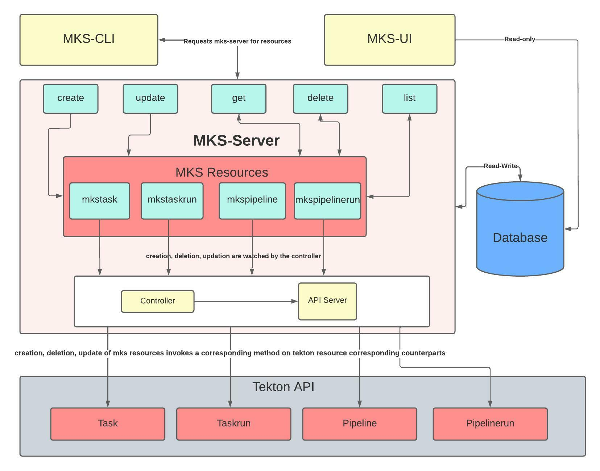

```go
 ███╗   ███╗██╗  ██╗███████╗  ███████╗███████╗██████╗ ██╗   ██╗███████╗██████╗
 ████╗ ████║██║ ██╔╝██╔════╝  ██╔════╝██╔════╝██╔══██╗██║   ██║██╔════╝██╔══██╗
 ██╔████╔██║█████╔╝ ███████╗  ███████╗█████╗  ██████╔╝██║   ██║█████╗  ██████╔╝
 ██║╚██╔╝██║██╔═██╗ ╚════██║  ╚════██║██╔══╝  ██╔══██╗╚██╗ ██╔╝██╔══╝  ██╔══██╗
 ██║ ╚═╝ ██║██║  ██╗███████║  ███████║███████╗██║  ██║ ╚████╔╝ ███████╗██║  ██║
 ╚═╝     ╚═╝╚═╝  ╚═╝╚══════╝  ╚══════╝╚══════╝╚═╝  ╚═╝  ╚═══╝  ╚══════╝╚═╝  ╚═╝
```

---

Minimal Tekton Server is a small application written in golang which listens for
'mks' custom resource being created and send requests to Tekton APIs to create
corresponding resource on a Kubernetes/OpenShift Cluster. It only takes few
required fields into consideration and provides options to customise them.

It runs as a server and currently three types of resources are supported.

- MksTask (Equivalent to Tekton 'Task')
- MksTaskRun (Equivalent to Tekton 'TaskRun')
- MksPipelineRun (Equivalent to Tekton 'PipelineRun')

```
Usage:

	./mks-server [flags]

The flags are:

	-kubeconfig
		Kubernetes configuration file. Automatically selects configuration from
		the cluster and user's home($HOME/.kube/config).
	-master
		The address of the kubernetes API server. Overrides any value in the
		kubeconfig.
	-addr
		The address of the Redis server. Defaults to 127.0.0.1:6379.
	-password
		The password of the Redis database.

```

This minimal server also serves the redis database. Database is used to store
the count the mks resources being created, deleted, is active, completed or
failed. The choice of the database is Redis due to its simplicity and easy
integration (see https://github.com/go-redis/redis).

This server can receive request via exposed API or by using Minimal Tekton
Server CLI application aka 'mks-cli' (see https://github.com/MiniTeks/mks-cli).
You can create, delete, list or update a particular resource and the changes are
transferred to the Tekton API and applied. See more about mks-cli in its
respective repository.

The live statistics of the resources can be seen using Minimal Tekton Server
Dashboard aka 'mks-ui' (see https://github.com/MiniTeks/mks-ui). The dashboard
is very minimal and shows all the stas in a tabular form. See more about mks-ui
in its respective repository.

---

## How To Build from the source

### Prerequisites

This application needs a `go compiler` to build and a kubernetes cluster to run.
You can also use `minikube` or `kind` to run on your local machine. Please install
in advance.

### Steps to build

- Clone the repository using:

```bash
    git clone https://github.com/MiniTeks/mks-server.git
```

- Make sure you have all the go dependencies

```bash
    go mod tidy

    go mod vendor
```

- Build the project using:

```bash
    go build .
```

- Make sure minikube cluster is running and tekton pipeline installed
- Apply Custom Resource Definition present in config/ according to custom resource(s) you want create

```bash
    kubectl apply -f config/mksCRDs/
```

- Running the redis-database

```bash
    kubectl apply -f k8s/ \
    kubectl port-forward <your redis-db pod, e.g-mks-db-6f544776bf-lsp2r > 6379:6379
```

- Run the executable using:

```bash
    ./mks-server -kubeconfig=<your kube config, defaults to local/cluster config>
```

- For checking create custom resource by applying custom-resource file

```bash
    kubectl apply -f config/mksResourceExample/<cr-example>.yaml
```

### Steps to Deploy on k8s/openshift cluster

0. Get the cluster configured, and create a namespace "*mks*"
```bash
	oc new-project mks
```
1. Install tekton pipelines operator in the cluster.
```bash
	oc apply --filename https://storage.googleapis.com/tekton-releases/pipeline/latest/release.yaml
```
2. Apply the files to create the mks resources inside the cluster
```bash
	oc apply -f config/mksCRDs
```
3 Get db server up and running.
```bash
	oc apply -f k8s/db-config
```
4. Get mks-server up and running.
```bash
	oc apply -f k8s/mks-config
```
5. Apply the files to create the mks resource examples
```bash
	oc apply -f config/mksResourceExample
```
6. Check the logs to verify
```bash
	oc logs -f -n mks $(oc get pods -n mks | grep mks-server | cut -d' ' -f1)
```

## Architectural Design



---

## License

Licensed under the Apache License, Version 2.0 (the "License"); you may not use this file except in compliance with the License.
